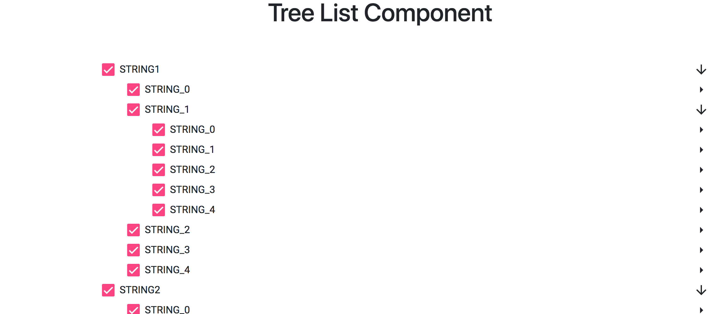

# 🚀 angular-tree-list

#### This project is a example tree view and selectable , lazy load children node

---

## Getting Started

#### 1. Clone and Install

```bash
# Clone the repo
git clone https://github.com/narongsaky/angular-tree-list.git

# Install dependencies
npm install
```

#### 2.1. Run command

```bash
ng serve
```

---



